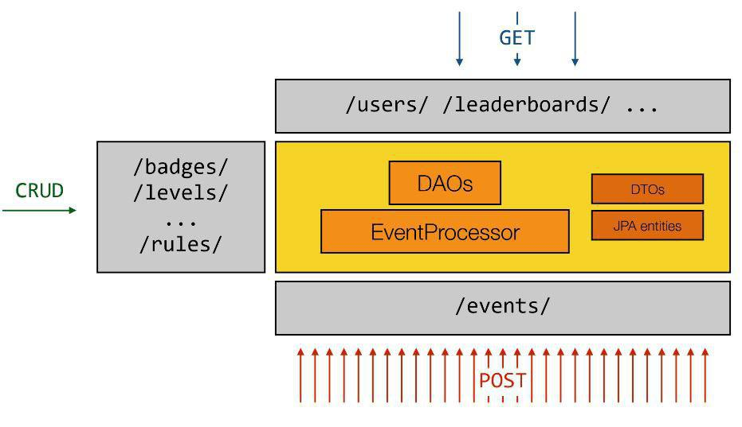

##GamifyApp

##Objectives

The objectif of this project is to develop and test a gamified application platform which attribute badges or points scales to users who post events, accordingly to rules established. You can learn more about a gamified platform [Here](https://en.wikipedia.org/wiki/Gamification). 

###High level architecture

 

As you can see on this architecture, applications which are registrered on our platform can create, get, update and delete **badges**, **pointScales** and **rules**. The users of an application can post events on our platform, and accordingly to the type of the event posted, it is possible to attribute a badge or a point scale to the user. If the user posting the event doesn't exists, we create the user in the application. It is also possible for the application to ask for the leaderboards (list of best users of the application).

##Technologies

This project was realized mainly with Spring Boot and Swagger. Indeed, a top-down approach was used in general. At the beginning we started with a swagger specification but we made adjustments to generate only the interface classes(DTOs)and the API. The bottom-up approach was also used to expose the documentation of specification within SpringFox.
The following technologies were used:

- [Spring Boot](http://projects.spring.io/spring-boot/)
- [Swagger Codegen](http://swagger.io/swagger-codegen/)
- [Swagger Editor](http://swagger.io/swagger-editor/)
- Spring Fox
- JPA
- Cucumber
- Postman
- Docker

##Deployment

###Requirements
The project assumes you have a working environement, with minimal config:

- IDE to launch and deploy (Netbeans 8.1)
- Docker 1.13.0
- Docker-Compose 1.10.0
- Maven 3.3.9
- Spring Boot 1.4.2
- Spring Fox 2.6.1
- Swagger 2.2.1
- Hibernate 4.1.9

###Docker images
The folder topology-amt contain three Dockers images:

- MySQL
- PHPMyAdmin 

###Run
To execute the application, you may follow these steps:

- Go to the topology-amt folder
- Build the docker images `docker-compose build`
- Run the topology `docker-compose up` 
- Go to /spring-server folder and run `mvn compile spring-boot:run`
- Or open Netbeans (it was tested with this IDE but nothing is against another one)

  - click open existing project
  - and add costumized goal `spring-boot:run` and click on it
  
- The application should be deployed (it will run Tomcat)

##Specification API

We have used [Swagger editor](http://editor.swagger.io/#/) to write the specification of our API Rest.  
You can see the documentation on the ``/docs`` dirctory of this repo. However, once the application is launched, an interactive documentation would be provided on http://localhost:8090/api.

##Test
In order to test our platform, we created a Java project. It is in this repo at the same level as the implementation of the platform.
The purpose of automated testing is to test API endpoints.
To do this, we used the framework [Cucumber](https: //cucumber.io/).

To run the tests, you may follow these steps:

1. check that the application has been started successfully.
2. Open the project with an IDE (Netbeans for example).
3. click Test

###Collaborators
Togue Kamga Thibaut, Norah Jeannine and Sarra Berich
